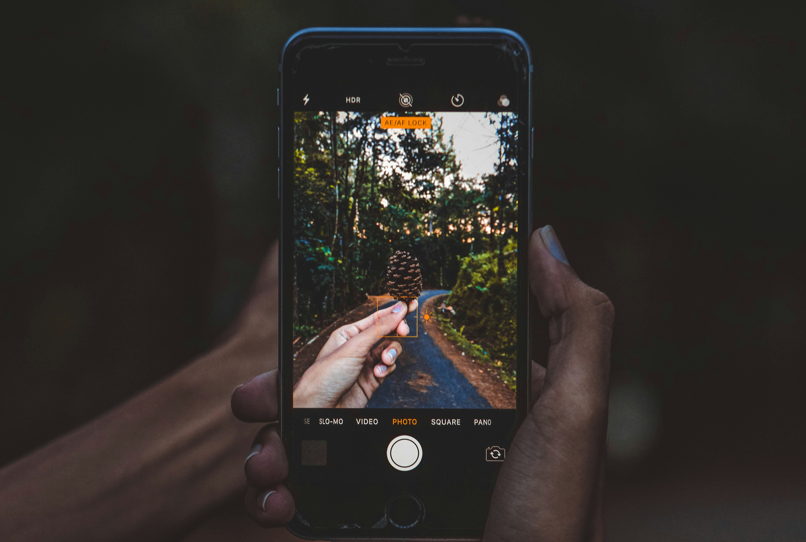

This is a [Next.js](https://nextjs.org) project bootstrapped with [`create-next-app`](https://nextjs.org/docs/app/api-reference/cli/create-next-app).

# Luca Clerot - Portfolio

<div align="center">
  
</div>

A modern, interactive portfolio website built with Next.js, Tailwind CSS, and Framer Motion. This portfolio showcases Luca Clerot's professional experience, skills, education, and projects with a beautiful dark-themed UI and interactive elements.

## ✨ Features

- **Responsive Design**: Works seamlessly on all device sizes
- **Interactive Particle Background**: Dynamic background with mouse interaction
- **Smooth Animations**: Powered by Framer Motion for elegant transitions
- **Dark Mode**: Beautiful dark theme with vibrant accents
- **Multilingual Support**: Content in English, Portuguese, and Spanish
- **Accessible UI**: Built with accessibility in mind using shadcn/ui components
- **Modern Tech Stack**: Next.js, TypeScript, Tailwind CSS, and more

## 📸 Screenshots

<div align="center">
  
  
</div>

## 🛠️ Tech Stack

- **Frontend Framework**: [Next.js](https://nextjs.org/)
- **Styling**: [Tailwind CSS](https://tailwindcss.com/)
- **Components**: [shadcn/ui](https://ui.shadcn.com/)
- **Animations**: [Framer Motion](https://www.framer.com/motion/)
- **State Management**: React Context API
- **Localization**: Custom i18n implementation
- **Deployment**: Static export for GitHub Pages, Netlify, or Vercel

## 🚀 Getting Started

### Prerequisites

- [Node.js](https://nodejs.org/) (v18 or later)
- [Bun](https://bun.sh/) (recommended) or npm

### Installation

1. Clone the repository
   ```bash
   git clone https://github.com/yourusername/luca-portfolio.git
   cd luca-portfolio
   ```

2. Install dependencies
   ```bash
   bun install
   # or
   npm install
   ```

3. Start the development server
   ```bash
   bun dev
   # or
   npm run dev
   ```

4. Open [http://localhost:3000](http://localhost:3000) in your browser

## 📦 Project Structure
